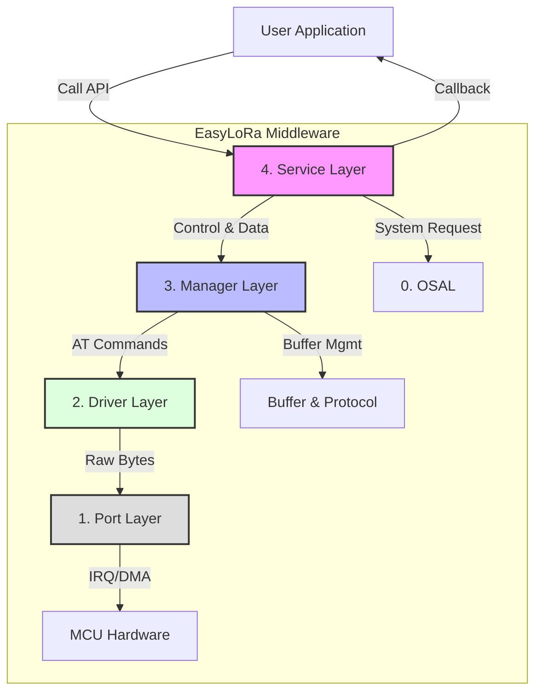

---

# 架构设计 (Architecture Design)

EasyLoRa 采用严格的 **分层架构 (Layered Architecture)** 设计。每一层仅依赖其直接下层提供的接口，严禁跨层调用。这种设计确保了协议栈的 **可移植性**、**可维护性** 和 **可扩展性**。

## 1. 架构全景图 (System Overview)

---

# 架构设计 (Architecture Design)

EasyLoRa 采用严格的 **分层架构 (Layered Architecture)** 设计。每一层仅依赖其直接下层提供的接口，严禁跨层调用。这种设计确保了协议栈的 **可移植性**、**可维护性** 和 **可扩展性**。

## 1. 架构全景图 (System Overview)

下图展示了 EasyLoRa 的核心分层结构及数据流向：

---

## 2. 分层职责详解 (Layer Details)

### 4. Service Layer (业务服务层)
*   **定位**: **系统的“大管家”**。它是 EasyLoRa 对外暴露的唯一窗口。
*   **核心职责**:
    1.  **业务聚合**: 向用户提供统一的 `Send`, `Init`, `Run` 接口，屏蔽底层复杂的初始化流程和状态机逻辑。
    2.  **系统交互**: 不仅负责 LoRa 通信，还负责向系统索要非通信资源（如 NVS 存储、系统复位、随机数种子）。
    3.  **高级功能**: 实现 OTA 参数配置 (CMD 解析)、掉电参数保存与恢复、死机自愈重启。
    4.  **状态监控**: 维护系统级状态（如“是否允许休眠”），聚合 Manager 和 Driver 的忙闲状态。

### 3. Manager Layer (设备管理层)
*   **定位**: **单实例设备的“大脑”**。它是协议栈的核心逻辑层。
*   **核心职责**:
    1.  **协议逻辑**: 实现 **Stop-and-Wait ARQ** (停等重传机制)，处理 ACK 确认、超时重发、序列号管理。
    2.  **数据流控**: 维护 **发送队列 (Tx Queue)** 和 **ACK 优先队列**，解决半双工通信下的读写冲突。
    3.  **去重过滤**: 维护接收去重表 (De-duplication Table)，过滤重复的重传包。
    4.  **状态机 (FSM)**: 驱动 IDLE -> TX -> WAIT_ACK -> DONE 的状态流转。
    *   *注：目前 Manager 层设计为管理单个 LoRa 模组实例。*

### 2. Driver Layer (模组驱动层)
*   **定位**: **AT 指令的“翻译官”**。
*   **核心职责**:
    1.  **指令封装**: 将 Manager 层的配置请求（如设置信道、功率）转换为具体的 AT 指令字符串（如 `AT+TPOWER=...`）。
    2.  **模式切换**: 控制模组进入 配置模式 (Configuration Mode) 或 透传模式 (Transparent Mode)。
    3.  **硬件适配**: 屏蔽不同模组（如 ATK-LORA-01 vs Ebyte E32）的指令集差异。

### 1. Port Layer (硬件接口层)
*   **定位**: **字节流的“搬运工”**。
*   **核心职责**:
    1.  **物理收发**: 直接操作 MCU 的 UART 外设（推荐使用 DMA），实现字节级的数据收发。
    2.  **引脚控制**: 操作 GPIO 控制模组的 AUX（忙闲指示）、MD0（模式选择）和 RST（复位）。
    3.  **硬件隔离**: 是唯一允许包含 `<stm32f10x.h>` 或 `driver/uart.h` 等厂商头文件的层级。

### 0. OSAL (操作系统抽象层)
*   **定位**: **环境的“适配器”**。
*   **核心职责**:
    1.  **时间管理**: 提供统一的 `GetTick` 和 `DelayMs` 接口。
    2.  **并发保护**: 提供 `EnterCritical` 和 `ExitCritical` 接口，确保环形缓冲区的线程安全。
    3.  **环境屏蔽**: 让上层代码无需关心是运行在裸机 (Bare-Metal) 还是 RTOS (FreeRTOS/RT-Thread) 上。

---

## 3. 关键设计决策 (Design Decisions)

### 3.1 为什么 Service 层需要处理 NVS？
LoRa 模组的配置（如信道、速率）通常需要掉电保存。
*   **Manager 层** 只负责“当前运行的参数”。
*   **Service 层** 通过回调函数 (`SaveConfig`/`LoadConfig`) 向用户系统索要存储能力。
*   **优势**: 这种设计使得 EasyLoRa 不依赖具体的文件系统或 Flash 驱动，用户可以自由选择将配置保存在内部 Flash、EEPROM 还是 SD 卡中。

### 3.2 为什么 Manager 层是单实例的？
目前的设计目标是 **轻量化** 和 **低资源占用**。
*   大多数嵌入式节点（如传感器、开关）仅需一个 LoRa 模组。
*   单实例设计避免了复杂的句柄管理和动态内存分配 (malloc)，极大地提高了系统的稳定性和确定性。
*   *未来扩展*: 若需支持多模组网关，可通过将全局变量封装为 Context 结构体来实现多实例复用。

### 3.3 为什么 Port 层要求非阻塞发送？
EasyLoRa 采用 **单线程轮询 (Run-to-Completion)** 模型。
*   如果 Port 层的发送函数是阻塞的（如 `while(TxBusy);`），整个协议栈的主循环将被卡死。
*   这将导致接收缓冲区溢出、ACK 超时判断失效、心跳丢失等严重问题。
*   因此，Port 层必须使用 **DMA** 或 **中断** 进行异步发送。

---

## 4. 模块交互示例 (Interaction Example)

以 **“发送一条需要 ACK 的数据”** 为例：

1.  **User** 调用 `Service_Send("Hello", NeedACK)`.
2.  **Service** 将请求透传给 **Manager**.
3.  **Manager** 将数据打包（加头、序列号、CRC），推入 **Tx Queue**.
4.  **Manager FSM** 检测到信道空闲，从队列取出数据，调用 **Port_Transmit**.
5.  **Port** 启动 DMA 发送，立即返回。
6.  **Manager** 进入 `WAIT_ACK` 状态，启动超时计时器。
7.  *(一段时间后)* **Port** 收到 ACK 包，存入 Rx Buffer。
8.  **Manager** 在下一次轮询中解析出 ACK，匹配序列号。
9.  **Manager** 通知 **Service** 发送成功。
10. **Service** 调用用户的 `OnEvent(TX_SUCCESS)` 回调。

---

## 2. 分层职责详解 (Layer Details)

### 4. Service Layer (业务服务层)
*   **定位**: **系统的“大管家”**。它是 EasyLoRa 对外暴露的唯一窗口。
*   **核心职责**:
    1.  **业务聚合**: 向用户提供统一的 `Send`, `Init`, `Run` 接口，屏蔽底层复杂的初始化流程和状态机逻辑。
    2.  **系统交互**: 不仅负责 LoRa 通信，还负责向系统索要非通信资源（如 NVS 存储、系统复位、随机数种子）。
    3.  **高级功能**: 实现 OTA 参数配置 (CMD 解析)、掉电参数保存与恢复、死机自愈重启。
    4.  **状态监控**: 维护系统级状态（如“是否允许休眠”），聚合 Manager 和 Driver 的忙闲状态。

### 3. Manager Layer (设备管理层)
*   **定位**: **单实例设备的“大脑”**。它是协议栈的核心逻辑层。
*   **核心职责**:
    1.  **协议逻辑**: 实现 **Stop-and-Wait ARQ** (停等重传机制)，处理 ACK 确认、超时重发、序列号管理。
    2.  **数据流控**: 维护 **发送队列 (Tx Queue)** 和 **ACK 优先队列**，解决半双工通信下的读写冲突。
    3.  **去重过滤**: 维护接收去重表 (De-duplication Table)，过滤重复的重传包。
    4.  **状态机 (FSM)**: 驱动 IDLE -> TX -> WAIT_ACK -> DONE 的状态流转。
    *   *注：目前 Manager 层设计为管理单个 LoRa 模组实例。*

### 2. Driver Layer (模组驱动层)
*   **定位**: **AT 指令的“翻译官”**。
*   **核心职责**:
    1.  **指令封装**: 将 Manager 层的配置请求（如设置信道、功率）转换为具体的 AT 指令字符串（如 `AT+TPOWER=...`）。
    2.  **模式切换**: 控制模组进入 配置模式 (Configuration Mode) 或 透传模式 (Transparent Mode)。
    3.  **硬件适配**: 屏蔽不同模组（如 ATK-LORA-01 vs Ebyte E32）的指令集差异。

### 1. Port Layer (硬件接口层)
*   **定位**: **字节流的“搬运工”**。
*   **核心职责**:
    1.  **物理收发**: 直接操作 MCU 的 UART 外设（推荐使用 DMA），实现字节级的数据收发。
    2.  **引脚控制**: 操作 GPIO 控制模组的 AUX（忙闲指示）、MD0（模式选择）和 RST（复位）。
    3.  **硬件隔离**: 是唯一允许包含 `<stm32f10x.h>` 或 `driver/uart.h` 等厂商头文件的层级。

### 0. OSAL (操作系统抽象层)
*   **定位**: **环境的“适配器”**。
*   **核心职责**:
    1.  **时间管理**: 提供统一的 `GetTick` 和 `DelayMs` 接口。
    2.  **并发保护**: 提供 `EnterCritical` 和 `ExitCritical` 接口，确保环形缓冲区的线程安全。
    3.  **环境屏蔽**: 让上层代码无需关心是运行在裸机 (Bare-Metal) 还是 RTOS (FreeRTOS/RT-Thread) 上。

---

## 3. 关键设计决策 (Design Decisions)

### 3.1 为什么 Service 层需要处理 NVS？
LoRa 模组的配置（如信道、速率）通常需要掉电保存。
*   **Manager 层** 只负责“当前运行的参数”。
*   **Service 层** 通过回调函数 (`SaveConfig`/`LoadConfig`) 向用户系统索要存储能力。
*   **优势**: 这种设计使得 EasyLoRa 不依赖具体的文件系统或 Flash 驱动，用户可以自由选择将配置保存在内部 Flash、EEPROM 还是 SD 卡中。

### 3.2 为什么 Manager 层是单实例的？
目前的设计目标是 **轻量化** 和 **低资源占用**。
*   大多数嵌入式节点（如传感器、开关）仅需一个 LoRa 模组。
*   单实例设计避免了复杂的句柄管理和动态内存分配 (malloc)，极大地提高了系统的稳定性和确定性。
*   *未来扩展*: 若需支持多模组网关，可通过将全局变量封装为 Context 结构体来实现多实例复用。

### 3.3 为什么 Port 层要求非阻塞发送？
EasyLoRa 采用 **单线程轮询 (Run-to-Completion)** 模型。
*   如果 Port 层的发送函数是阻塞的（如 `while(TxBusy);`），整个协议栈的主循环将被卡死。
*   这将导致接收缓冲区溢出、ACK 超时判断失效、心跳丢失等严重问题。
*   因此，Port 层必须使用 **DMA** 或 **中断** 进行异步发送。

---

## 4. 模块交互示例 (Interaction Example)

以 **“发送一条需要 ACK 的数据”** 为例：

1.  **User** 调用 `Service_Send("Hello", NeedACK)`.
2.  **Service** 将请求透传给 **Manager**.
3.  **Manager** 将数据打包（加头、序列号、CRC），推入 **Tx Queue**.
4.  **Manager FSM** 检测到信道空闲，从队列取出数据，调用 **Port_Transmit**.
5.  **Port** 启动 DMA 发送，立即返回。
6.  **Manager** 进入 `WAIT_ACK` 状态，启动超时计时器。
7.  *(一段时间后)* **Port** 收到 ACK 包，存入 Rx Buffer。
8.  **Manager** 在下一次轮询中解析出 ACK，匹配序列号。
9.  **Manager** 通知 **Service** 发送成功。
10. **Service** 调用用户的 `OnEvent(TX_SUCCESS)` 回调。