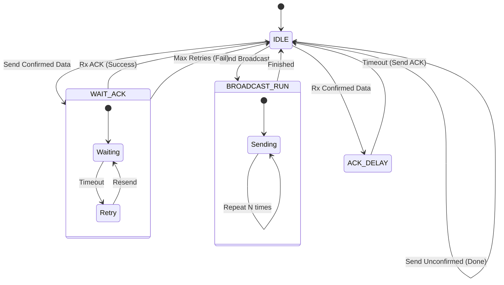
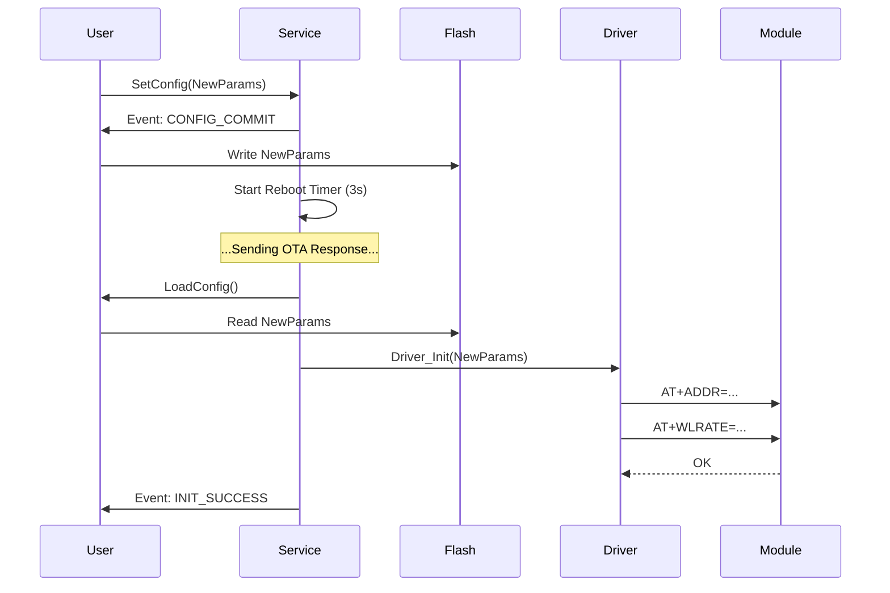

# 数据流与状态机分析 (Data Flow & FSM Analysis)

本文档深入剖析 **EasyLoRa** 的内部逻辑核心，包括协议状态机 (FSM) 的流转逻辑、数据包在各层之间的流动路径，以及配置持久化的生命周期。

---

## 1. 核心状态机 (Manager FSM)

**Manager Layer** 维护了一个有限状态机 (Finite State Machine)，它是实现 **Stop-and-Wait ARQ (停等重传协议)** 的大脑。该状态机确保了在半双工、不可靠的 LoRa 物理链路上实现逻辑上的可靠传输。

### 1.1 状态定义

| 状态枚举 (`LoRa_FSM_State_t`) | 描述 | 行为逻辑 |
| :--- | :--- | :--- |
| **`IDLE`** | **空闲态** | 默认状态。FSM 轮询发送队列。若有数据且物理层空闲，则触发发送并跳转。 |
| **`WAIT_ACK`** | **等待确认** | 已发送需要 ACK 的数据包 (`Confirmed`)。开启超时计时器。若超时未收到 ACK，触发重传；若重传耗尽，报告失败。 |
| **`ACK_DELAY`** | **ACK 延时** | 收到对方的 `Confirmed` 包，准备回复 ACK。**故意延时** (如 100ms) 以等待对方从 TX 切换回 RX 模式，防止半双工冲突。 |
| **`BROADCAST_RUN`** | **广播盲发** | 正在执行广播任务。由于广播无 ACK，FSM 会连续盲发 N 次 (如 3 次) 以提高送达率，随后自动回到 IDLE。 |

### 1.2 状态流转图 (State Diagram)



### 1.3 关键策略

1.  **ACK 优先策略**: FSM 在调度发送时，总是优先检查 **ACK 队列**。只有当 ACK 队列为空时，才处理普通数据队列。这保证了控制信令的及时性。
2.  **随机避退 (CSMA/CA)**: 在重传 (`Retry`) 时，FSM 不会立即重发，而是引入 `Base + Random(0~500ms)` 的随机延时，降低多节点同时重传导致的持续碰撞概率。
3.  **去重机制 (De-duplication)**: FSM 维护一个 LRU 去重表。如果收到一个 `Seq` 与最近记录相同的包，FSM 会丢弃数据（不回调 User），但**依然会回复 ACK**（防止 ACK 丢失导致对方无限重传）。

---

## 2. 通用数据流架构 (General Data Flow)

EasyLoRa 采用 **双环形缓冲区 (Dual RingBuffer)** + **双队列 (Dual Queue)** 架构来实现异步解耦。

*   **上行 (TX)**: User -> Struct Queue -> Serialized RingBuffer -> DMA -> Air
*   **下行 (RX)**: Air -> DMA -> Raw RingBuffer -> Parser -> User

```mermaid
graph TD
    subgraph User Space
        App[User App]
    end

    subgraph Service Layer
        API_Send[LoRa_Service_Send]
        CB_Recv[OnRecvData Callback]
    end

    subgraph Manager Layer
        TxQ[Tx Request Queue<br>(Struct Array)]
        TxRing[Tx RingBuffer<br>(Serialized Bytes)]
        AckRing[ACK RingBuffer<br>(High Priority)]
        RxRing[Rx RingBuffer<br>(Raw Bytes)]
        
        FSM[FSM Scheduler]
        Parser[Protocol Parser]
    end

    subgraph Port Layer
        DMA_Tx[DMA Transmit]
        DMA_Rx[DMA Receive]
    end

    %% TX Path
    App --> API_Send
    API_Send --> TxQ
    TxQ -->|Serialize| TxRing
    FSM -->|Check Priority| AckRing
    FSM -->|Check Normal| TxRing
    AckRing --> DMA_Tx
    TxRing --> DMA_Tx

    %% RX Path
    DMA_Rx --> RxRing
    RxRing --> Parser
    Parser -->|Data Packet| CB_Recv
    Parser -->|ACK Packet| FSM
    CB_Recv --> App
```

---

## 3. 详细数据流场景

### 3.1 发送数据流 (TX Flow)

当用户调用 `LoRa_Service_Send("Hello", Confirmed)` 时：

1.  **入队 (Enqueue)**:
    *   数据被封装为 `TxRequest_t` 结构体（包含 Payload, TargetID, Options）。
    *   推入 **TxRequest Queue**。此时函数立即返回 `MsgID`，**非阻塞**。
2.  **序列化 (Serialization)**:
    *   主循环 (`Run`) 检测到队列有数据。
    *   将结构体打包成符合协议的字节流 (Head, Len, Ctrl, Seq, Addr, Payload, CRC, Tail)。
    *   写入 **Tx RingBuffer**。
3.  **调度 (Scheduling)**:
    *   FSM 检查物理层 (`IsTxBusy` / `GetAUX`)。
    *   若空闲，启动 DMA 发送。
    *   FSM 状态切换为 `WAIT_ACK`，记录当前时间。
4.  **结果 (Result)**:
    *   **成功路径**: 收到 ACK -> FSM 触发 `LORA_EVENT_TX_SUCCESS_ID`。
    *   **失败路径**: 超时 N 次 -> FSM 触发 `LORA_EVENT_TX_FAILED_ID`。

### 3.2 接收数据流 (RX Flow)

当模组从空中收到数据时：

1.  **物理接收**:
    *   MCU 的 DMA 自动将 UART 数据搬运到 `s_DmaRxBuf` (用户层 RAM)。
2.  **拉取 (Pull)**:
    *   主循环 (`Run`) 调用 `Buffer_PullFromPort`。
    *   数据从 `s_DmaRxBuf` 复制到 **Rx RingBuffer** (核心层 RAM)。
3.  **解析 (Parse)**:
    *   `Protocol_Unpack` 尝试从 RingBuffer 中识别完整数据包。
    *   校验 CRC16。
    *   校验 `TargetID` (是否发给我？是否广播？)。
4.  **分发 (Dispatch)**:
    *   **若是 ACK 包**: 交给 FSM 处理，更新状态机（清除 `WAIT_ACK`）。
    *   **若是数据包**:
        *   查重：检查 `SourceID` + `Seq` 是否存在于去重表。
        *   若重复：丢弃 Payload，但如果对方要求 ACK，则触发 `ACK_DELAY` 状态准备回复。
        *   若新包：触发 `OnRecvData` 回调给用户。

---

### 3.3 配置与重启数据流 (Config & Reboot Flow)

当开启 `LORA_ENABLE_FLASH_SAVE` 后，参数修改与持久化的流程如下：

1.  **触发修改**:
    *   用户调用 `LoRa_Service_SetConfig()` 或收到 OTA 指令 (`CMD:CFG=...`)。
2.  **内存更新**:
    *   Service 层更新 RAM 中的 `LoRa_Config_t` 变量。
3.  **持久化请求**:
    *   Service 层触发 `LORA_EVENT_CONFIG_COMMIT` 事件。
    *   **用户回调**: 用户的 `SaveConfig` 函数被调用，将配置写入 MCU 的 NVS/Flash。
4.  **重启请求**:
    *   Service 层触发 `LORA_EVENT_REBOOT_REQ`。
    *   Service 状态机进入 `REBOOT_WAIT` (倒计时，例如 3秒)，确保 OTA 回执能先发出去。
5.  **执行软重启**:
    *   倒计时结束，Service 调用 `_Service_DoReinit`。
    *   **加载配置**: 调用用户的 `LoadConfig` 从 Flash 读取最新参数。
    *   **驱动重置**: 调用 `Driver_Init`，通过 AT 指令将新参数写入 LoRa 模组。
    *   **恢复运行**: 协议栈回到 `RUNNING` 状态，使用新参数通信。

